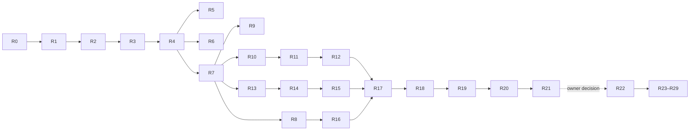

# Volume-reduction refactoring plan (YAGNI + DRY)

Status: **Part 1 done** — Phase A–B (R0–R7) **done** (change
`refactor-volume-tests`, Checkpoint 1 green, run 36850058681, measured
Δ −499). Phase C–F (R8–R16) **done** (change `refactor-volume-core`,
Checkpoint 2 green through macOS, run 36855766168, measured Δ −623).
Phase G (R17–R21) **done** (change `refactor-volume-build`, Checkpoint 3
green through macOS, run 36864472674, measured Δ −90 code+tools plus
−301 `AGENTS.md`; the AGENTS.md slimming is the former P21). Snapshot
taken 2026-10-01 against `main` at `cdf1c67`
(after `refactor-safety-net`, `refactor-split-modules` and
`refactor-long-functions`). The previous plan — split and decompose, implemented
through its Checkpoint 3 — is in git history (`git show cdf1c67:docs/refactoring.md`).
Archived changes cite its section numbers.

The goal is **fewer hand-maintained lines** while keeping the same verification
strength, the same architecture and the same ADR invariants. The plan has two
parts:

- **Part 1 (R0–R21): behavior-preserving.** No script-facing API change, no
  `js-api` delta, no `efx.d.ts` change, no golden re-baseline. The error catalog
  (`tests/scripts/s_error_catalog.expected.txt`) stays byte-identical. The only
  test-inventory change is R1, which registers four cases that exist today but
  never run.
- **Part 2 (R22+): architectural, ADR-gated.** Option-bag validation is
  currently written twice, once in each binding. Part 2 moves it into the shared
  prelude. This changes error *text* where the two bindings disagree today, so it
  needs its own OpenSpec change, an ADR and a `js-api` delta. It starts only
  after an owner decision.

---

## 1. Baseline

Non-blank lines of hand-maintained code, from `git ls-files`. Excluded: `vendor/`,
generated committed files (`shaders/*.h` per ADR 0021, `src/prelude/prelude.h`,
`docs/api/` per ADR 0048), fixtures, goldens, and gallery samples.

| Area | Non-blank lines |
|------|----------------:|
| `src/api` (desktop quickjs binding) | 6 257 |
| `src/web/js` (web binding, `--post-js` fragments) | 3 638 |
| `src/web/*.c,*.h` (wasm bridge) | 1 926 |
| `src/render` | 5 082 |
| `src/physics` | 3 086 |
| `src/platform` | 2 384 |
| `src/resource` | 1 630 |
| `src/runtime` + `src/player` + `main.c` | 1 510 |
| `src/input` | 1 399 |
| `src/audio` | 905 |
| `src/prelude/prelude.js` | 552 |
| `src/math` | 145 |
| `tests/` (C, CMake, portable scripts) | 9 670 |
| `tools/` | 1 775 |
| root `CMakeLists.txt` | 601 |
| **Total** | **40 560** |

Measurement command. Every pass reports its Δ with it (evidence E4):

```bash
git ls-files src tests tools CMakeLists.txt \
  | grep -E '\.(c|h|cpp|js|mjs|py|cmake|txt)$' \
  | grep -vE 'prelude\.h$|fixtures/|goldens/|expected\.txt$' \
  | xargs grep -cv '^\s*$' | awk -F: '{s+=$2} END {print s}'
```

```powershell
git ls-files src tests tools CMakeLists.txt |
  Where-Object { $_ -match '\.(c|h|cpp|js|mjs|py|cmake|txt)$' -and
                 $_ -notmatch 'prelude\.h$|fixtures/|goldens/|expected\.txt$' } |
  ForEach-Object { (Get-Content $_ | Where-Object { $_.Trim() }).Count } |
  Measure-Object -Sum
```

---

## 2. Findings

### 2.1 The dominant duplication: two bindings validate everything

ADR 0022 implements the `efx` API twice: once for desktop quickjs
(`src/api/*.c`) and once for the browser engine (`src/web/js/*.js` over
`src/web/bridge_*.c`). Each binding has its own option-bag validation:

- **391** throw sites in `src/api/*.c` and **323** in `src/web/js/*.js`
  (**246** unique web messages).
- The catalog pins 208 lines, and its `DIVERGENT` map lists **18** cases where
  the two copies already disagree.
- Every new option is written, reviewed and tested twice.

Part 1 can only remove duplication *inside* each binding. Part 2 removes the
duplication *between* them.

### 2.2 Desktop binding (`src/api`)

- **Destroy/finalize written three times per class.**
  [`js_destroy_resource`](../src/api/api.c#L421) is a 118-line chain of
  `JS_GetOpaque2` probes, one per class. It repeats what the 11 `*_release`
  helpers and 11 one-line `*_finalizer` shims ([api.c L335–L592](../src/api/api.c#L335))
  already express. **Latent issue (suspected):** `JS_GetOpaque2` *throws* on a
  class mismatch (`vendor/quickjs-ng/quickjs.c` L12125). So `destroy()` on any
  non-Texture leaves pending TypeErrors behind while it returns `undefined`.
- **Body/Character are twins.** `efxjs_body` and `efxjs_character` have the same
  layout, and both handles are `uint32_t`. `wrap_body`/`wrap_character`
  ([api_physics.c L201–L253](../src/api/api_physics.c#L201)), the finalizers, the
  unpin helpers, the live resolvers, the teardown loops and the
  position/velocity accessors all come in pairs.
- **Domain reader wrappers survived P3.** `audio_opt_number`/`audio_opt_bool`
  ([api_audio.c L6](../src/api/api_audio.c#L6)), `phys_opt_*`
  ([api_physics.c L50](../src/api/api_physics.c#L50)) and `get_opt_number`
  ([api_text.c L14](../src/api/api_text.c#L14)) re-implement
  `efx_api_opt_*`. They differ only in policy (whether null counts as absent,
  strict vs coercing, message format).
- **Misplaced code from the byte-slice split.** `drawQuad`/`setBlendMode` live in
  `api_target_post.c`, and `poseMesh`/`setCamera3D` live in `api_particles.c`.

### 2.3 Web binding (`src/web`)

- **Return-code ladders:** 27 `if (rc === N) throw …` blocks. Codes 1, 4 and 9
  map to the same three messages everywhere.
- **Heap clean-up ladders:** 63 explicit `_efx_bridge_mem_free` calls.
  `createFont` alone frees `glyphsPtr` by hand before **10** different throws
  ([text.js L13–L120](../src/web/js/text.js#L13)).
- **Duplicated helpers:** `__efxAllocCStr` is defined twice
  ([core.js L41](../src/web/js/core.js#L41), [L784](../src/web/js/core.js#L784)).
  `__physNumber` ([physics.js L1](../src/web/js/physics.js#L1)) and
  `__efxAudioNum` ([audio.js L20](../src/web/js/audio.js#L20)) are identical.
  `sourceRect` validation is written out 3 times. `efx_bridge_mem_free` wraps
  `free`, which is already exported as `_free`.
- **Bridge surface:** 171 exports. **31** of them are pure one-line passthroughs
  to a core `efx_*` function. About 20 more are per-field getters, e.g. 11
  `efx_bridge_input_*` event-field reads in
  [bridge_input.c](../src/web/bridge_input.c).

### 2.4 Core modules

- **Render defaults are written twice, field by field.** `ensure_state` and
  `efx_render_reset_state` repeat the same block, and the camera, camera3d and
  material defaults are assigned one field at a time
  ([render_records.c L28–L99](../src/render/render_records.c#L28)).
- **Record header stamped 6 times.** All 6 record producers set
  `target = R.active_target` and `sort_key = record_count` before calling
  [`record_push`](../src/render/render_records.c#L241). The
  "color or white" loop appears 3 times.
- **Single-use wrappers:** `texture_bind_retain`/`_release` only forward to
  `map_bind_retain`/`_release`
  ([render_texture.c L155–L194](../src/render/render_texture.c#L155)).
- **Pipeline:** the quad and billboard pipeline descriptors differ only in
  `depth.compare` ([pipeline.c L471–L503](../src/platform/pipeline.c#L471)).
  `post_draw` takes the same sampler twice in every call, plus a `has_fs` flag
  that just means `fs != NULL`. The two-pass separable blur is written out 3
  times in `run_post_entry`. `emit_quad`/`emit_quad_bridged` are near copies.
- **Input/audio/gamepad:** each input feeder repeats
  `memset` → assign fields → edge update → push
  ([input.c L263–L368](../src/input/input.c#L263)). The five audio voice
  setters repeat the same bounds and active guard
  ([audio.c L455–L498](../src/audio/audio.c#L455)). The gamepad accessors and
  the four name↔id tables have the same shape.
- **Runtime/player:** `efx_runtime_destroy` frees 11 hook lists by hand, even
  though `efx_host_hook_list(h, which)` exists. `run_root_mode`
  ([player.c L190](../src/player/player.c#L190)) and `efx_repl_run`
  ([repl.c L227](../src/player/repl.c#L227)) duplicate the run-entry,
  exit-code and teardown sequence.

### 2.5 Dead or over-exported code

- `src/physics/efx_phys_vec.h` declares `efx_quat`, `efx_mat3` and 8 inline
  helpers that nothing uses (`efx_quat_identity`, `efx_mat3_*`, `efx_v3_mul`,
  `efx_v3_min_component`, `efx_aabb_contains`). Physics is linear-only
  (ADR 0040). `check_exports.mjs` cannot see these because it only scans
  non-inline declarations.
- About 35 header-declared `efx_*` functions are referenced only inside their
  defining TU (no other TU, no test). Examples: `efx_skin_mat_inverse`,
  `efx_rig_clone`, `efx_hooks_free_all`, `efx_api_read_channel_color`,
  `efx_world_generate_contacts` and the `efx_narrow_closest_*` family.

### 2.6 Tests and build

- **Case names are kept in two places, and they have already drifted.** Each
  suite has a C dispatch table and a CMake `foreach(CASE …)` list. Four cases
  are compiled but **never registered with ctest**:
  - `t_thin_floor_large_dt`, `t_fast_body_thin_floor` and `t_force_substep`
    ([tests/physics/main.c L25–L27](../tests/physics/main.c#L25)) — the ADR 0045
    tunneling tests.
  - `clear_color_js` (api_tests).
- 7 copies of `fail()` (5 also with `feq()`), and 7 hand-written `strcmp`
  dispatch `main`s. `tests/physics/main.c` already uses a `CASE` table.
- `api_tests.c` has 89 four-line `{ end_js(); return fail(…); }` blocks, and the
  JS helper `function t(fn, kind)` is pasted into 6 snippets.
- Root `CMakeLists.txt`: 8 test executables repeat the same include, `-lm`,
  memory-growth and warning-flag boilerplate. The render-core source list is
  spelled out 4×. The `efx_core` source list is duplicated between the web and
  desktop variants.
- `tests/CMakeLists.txt`: `add_player_test`/`add_web_test` duplicate their
  argument plumbing, and the `smoke_*`/`web_*` case lists mirror each other.

### 2.7 Comments

There are 1 737 comment-only lines in `src/`. **101** of them point at
`design D#` and **16** at refactor pass ids `P#`. Those ids only resolve inside
archived change folders. A few others describe history ("formerly
`bridge.c`", "`entry.js`").

### 2.8 Kept intentionally

| Item | Why it stays |
|------|--------------|
| Two bindings | ADR 0022. Part 1 shrinks each one; only Part 2 shares code between them. |
| `shaders/*.h`, `prelude.h`, `docs/api/` | Generated and committed by design (ADR 0021, `gen_prelude.py --check`, ADR 0048). |
| `efx_phys_vec.h` vs GLM | Dependency-free physics core (ADR 0040). Only the unused parts go (R5). |
| `efx_input_inject_*` aliases | ADR 0036 names the seam. Gamepad inject/`load_mappings` are covered by `gp_seams`. |
| Core re-validation (`ps_config_valid`, `post_entry_valid`) | Defense in depth at the C ABI boundary. |
| Narrow-phase pairs, world query loops | Determinism (ADR 0040/0045). The savings would be a handful of lines. |
| `makeCube`/`makePlane`/`makeSphere`/`makeCapsule` | Different topologies. A shared generator would be harder to read than four loops. |
| `tools/gen_gltf_fixtures.py`, `gallery/scripts/gen-audio-assets.py` | Keep the committed fixtures reproducible. |
| Repetition in `.github/workflows/*.yml` | About 25 lines, but every edit costs a full V5 cycle. |

---

## 3. Validation ladder

Rungs are cumulative. Every pass names the minimum rung it must reach.

| Rung | Check | Where |
|------|-------|-------|
| **V1** | `cmake -B build-h -DEFX_HEADLESS=ON`, `cmake --build build-h`, `ctest --test-dir build-h` (unit suites) | local |
| **V2** | Full build with goldens: `cmake -B build -DEFX_BUILD_DEV_HARNESS=ON -DEFX_BUILD_GOLDEN_TESTS=ON -DCMAKE_BUILD_TYPE=Release`, `cmake --build build --config Release -j8`, `ctest --test-dir build -C Release` | local (Windows/D3D11) |
| **V3** | Generated files: `python tools/gen_prelude.py --check`; `npm --prefix gallery run docs:markdown` then `git diff --exit-code docs/api` (`docs:check` fails locally on Windows/Node 26) | local |
| **V4** | `python3 tools/verify_remote.py all <branch>`: native ctest incl. goldens on llvmpipe, Emscripten ctest, web goldens, `run_web_compare.mjs`, `run_web_harness.mjs`, gallery smoke | SSH server |
| **V5** | `gh workflow run ci.yml --ref <branch>`, run in the order Linux → Windows → macOS | CI |

Evidence attached to a pass's PR:

- **E1 Error catalog:** `smoke_error_catalog` and `web_error_catalog` stay
  byte-identical to `s_error_catalog.expected.txt`. The file itself must not
  change anywhere in Part 1.
- **E2 Test inventory:** `ctest -N` lists from the V1, V2 and Emscripten (V4)
  builds. Names must match the post-R1 inventory exactly.
- **E3 Symbol surface:** `nm -g --defined-only` (or `dumpbin /symbols`) of
  `efx_core` shows only the intended removals.
- **E4 Volume:** the §1 command, before and after.
- **E5 Build flags:** for CMake-only passes, `compile_commands.json`
  (Ninja, `-DCMAKE_EXPORT_COMPILE_COMMANDS=ON`) is identical after sorting.
- **E6 Web surface:** `node tools/check_exports.mjs` reports zero, and the
  `Module._*` export list differs only by the intended renames.
- **E7 Comment-only proof:** for each touched C/C++ file,
  `cc -fpreprocessed -dD -E` output is identical before and after.

---

## 4. Part 1 passes (behavior-preserving)

Each pass is one reviewable commit or PR. Phases are listed in execution order.
Phase A comes first because it makes the safety net stronger before any
production code moves.

### Phase A — Safety net and test harness

#### R0. Record the baseline

- **Status:** done — 40 561 lines; inventories 186/293/156; recorded in the
  archived `refactor-volume-tests` change.
- **Current behavior:** there is no volume metric and no recorded test
  inventory.
- **Structural improvement:** none to the code. Record the §1 numbers, the
  three `ctest -N` lists and the `efx_core` symbol list in the change's
  `design.md`. This adds no tool (YAGNI) — the commands live in §1 and §3.
- **Validation:** the numbers can be reproduced on a clean checkout.
- **Est. Δ:** 0.

#### R1. Register the orphaned unit cases

- **Status:** done — all four pass on every target; no fix was needed.
- **Current behavior:** `t_thin_floor_large_dt`, `t_fast_body_thin_floor`,
  `t_force_substep` and `clear_color_js` compile but are never run by ctest.
- **Structural improvement:** add the four names to the CMake case lists. This
  is a stopgap; R3 makes this kind of drift impossible. If any of them fails,
  stop and fix it under its own change — that would be a behavior bug, not
  refactoring.
- **Validation:** V1 + V2. E2 shows exactly +4 names.
- **Est. Δ:** +4.

#### R2. One test-support header and `CASE` tables

- **Status:** done — run-all mode exposed a per-process class-registration
  guard in `efx_api_init` (deleted, own commit).
- **Current behavior:** 7 suites each define `fail()` (5 also define `feq()`)
  and a hand-written `strcmp` chain in `main`. Physics already uses a `CASE`
  table and runs every case when given no argument.
- **Structural improvement:** promote `tests/physics/test_support.h` to
  `tests/test_support.h`. It gains `fail`, `feq`, `EFX_CASE(fn)` and
  `efx_test_main(cases, n, argc, argv)`, with the physics behavior (no argument
  runs all; unknown case exits 2). Each suite's `main` becomes a `CASE` table.
- **Validation:** V1 + V2. E2 identical. An unknown case still exits 2.
- **Est. Δ:** −150.

#### R3. One source of truth for case names

- **Status:** done.
- **Current behavior:** the case names live both in the C tables and in the
  CMake `foreach(CASE …)` lists ([tests/CMakeLists.txt L176–L248](../tests/CMakeLists.txt#L176)).
  R1 shows these already drifted.
- **Structural improvement:** add `efx_register_unit_cases(target source)`.
  It reads the `EFX_CASE(name)` tokens with `file(STRINGS … REGEX)`, puts the
  source in `CMAKE_CONFIGURE_DEPENDS`, and replaces the hand-written lists.
- **Validation:** V1 + V2 + V4 (the Emscripten ctest registers the same names).
  E2 is identical to the post-R1 inventory.
- **Est. Δ:** −70.

#### R4. `REQUIRE` and a shared JS assertion helper in `api_tests.c`

- **Status:** done — 89 blocks, 9 (not 6) pasted helpers; 8 resource blocks.
- **Current behavior:** 89 four-line clean-up-and-fail blocks, plus 6 pasted
  copies of the JS `t(fn, kind)` helper inside C string snippets.
  `resource_tests.c` has 9 similar blocks.
- **Structural improvement:**
  `#define REQUIRE(c, msg) do { if (!(c)) { end_js(); return fail(msg); } } while (0)`.
  Add a `T_HELPER` string literal that snippets concatenate at compile time.
  Prepending it at runtime was rejected: it would shift line numbers in error
  output.
- **Validation:** V1 + V2. E2 identical. Flip one assertion locally once to
  confirm the failure path still prints its message and cleans up.
- **Est. Δ:** −300.

### Phase B — Delete dead code and unused surface

#### R5. Remove the unused physics math

- **Status:** done.
- **Current behavior:** `efx_quat`, `efx_mat3` and 8 inline helpers in
  [efx_phys_vec.h](../src/physics/efx_phys_vec.h#L28) have no users.
- **Structural improvement:** delete them. Change ADR 0040's "own
  vec3/quat/mat3" to "own vector math" in the same commit.
- **Validation:** V1 (`efx_physics_tests`), plus V5 compile on all four
  toolchains. A grep for the names finds zero references.
- **Est. Δ:** −45.

#### R6. Internal linkage for single-TU functions

- **Status:** done — 30 functions; none became unused. Web had none: the
  `efx_web_*` functions are `EMSCRIPTEN_KEEPALIVE` exports used by `boot.js`.
- **Current behavior:** about 35 `efx_*` functions are declared in a header but
  used only by the TU that defines them (§2.5).
- **Structural improvement:** make them `static` and drop the declarations. One
  commit per module. Exclusions: anything named by a spec or ADR, test seams,
  and anything the web build exports (see R14). With `-Werror`/`/WX`, a function
  that turns out to be unused breaks the build — delete it.
- **Validation:** V1 + V5 compile on MSVC, Clang, GCC and emcc. E3 shows
  removals only. E6 is zero.
- **Est. Δ:** −70.

#### R7. Remove duplicate web helpers

- **Status:** done.
- **Current behavior:** the second `__efxAllocCStr`, the identical
  `__physNumber`/`__efxAudioNum`, and the `efx_bridge_mem_free` wrapper around
  the already-exported `_free`.
- **Structural improvement:** keep one of each and point the call sites at it
  (the 63 `mem_free` sites become `_free`).
- **Validation:** V4. E1 is identical on web. E6.
- **Est. Δ:** −20.

### Phase C — Simplify control flow in core modules

#### R8. Render: constant defaults, stamped record header, no single-use wrappers

- **Status:** done. `efx_render_begin_target` sets the active target before
  `record_push`, so the begin record is stamped with its own target.
- **Current behavior:** see §2.4 (defaults written twice and field by field,
  6 header stamps, 3 color loops, 2 forwarding wrappers).
- **Structural improvement:**
  - `static const` designated-initializer defaults for camera2d, camera3d and
    material.
  - One `apply_default_state()` shared by `ensure_state` and
    `efx_render_reset_state`.
  - `record_push` stamps `target` and `sort_key` itself.
  - One `color_or_white()` helper.
  - Inline `map_bind_retain`/`_release` into their only callers.
- **Validation:** V1 (`render_tests` `default_camera_viewport`,
  `lights_state`, `material_binding`, `record_fields`,
  `mesh_record_fields`, `billboard_record_fields`, `segmentation`;
  `api_tests` `default_camera`), plus V2 goldens.
- **Est. Δ:** −85.

#### R9. Input, audio and gamepad accessors

- **Status:** done. Gamepad slots only need a range guard, so `live_slot`
  does not check `connected` (unchanged behavior).
- **Current behavior:** see §2.4.
- **Structural improvement:**
  - Input feeders push compound literals and share one
    `set_level(down, pressed, released, i, is_down)` edge helper.
  - `live_voice(voice)` returns NULL when the voice is out of range or
    inactive, so each setter is three lines.
  - `live_slot(slot)` does the same for the gamepad accessors.
  - One `name_lookup(table, n, name)` serves the four name↔id pairs.
  - `efx_input_inject_*` stay (ADR 0036).
- **Validation:** V1 (`efx_input_tests` all cases incl. `gp_*`,
  `efx_audio_tests`, `api_tests` `input_js`/`gamepad_js`/`audio_js`), plus
  V4 (`web_9_input`, `web_13_gamepad`, `web_14_audio`, compare).
- **Est. Δ:** −80.

#### R10. Runtime and player lifecycle

- **Status:** done. `efx_player_run_entry` returns stop/continue and writes
  the exit code to an out-parameter. A −1 sentinel would collide with
  `efx.quit(-1)`.
- **Current behavior:** 11 hand-written `efx_hooks_free_all` calls. Player root
  mode and the REPL duplicate run-entry → error/quit check → exit code →
  teardown.
- **Structural improvement:**
  - Loop over `efx_host_hook_list(h, which)`.
  - Add `player_run_entry(rt, res)` (returns "continue" or an exit code) and
    `player_exit_code(rt)`. Both `player.c` and `repl.c` use them.
  - The teardown order (runtime → render end/shutdown → platform → resource)
    does not change.
- **Validation:** V2: the `smoke_*` exit-code cases (ADR 0007), `smoke_quit3`,
  `smoke_root_*`, `smoke_repl_*`, and `api_tests` `repl_eval`/`hooks_registration`.
- **Est. Δ:** −50.

### Phase D — Desktop binding

#### R11. Table-driven destroy and finalize

- **Status:** done. The leak was **confirmed** for all ten non-Texture
  classes. `destroy_no_pending_exception` failed on the old code and passes
  now (§6).
- **Current behavior:** the 118-line probe chain, plus 11 release helpers and
  11 finalizer shims (§2.2).
- **Structural improvement:**
  - Each `CLASS_SPECS` row gains `destroy(ctx, p)` (what script `destroy()`
    does) and `release(p)` (what the finalizer does). These stay separate per
    class because the semantics differ: ImageData frees its pixels only in the
    finalizer, and Audio stops its voice only in `destroy()`.
  - One generic finalizer and one `destroy()` dispatch through
    `JS_GetAnyOpaque`.
  - Messages stay the same (`"not a resource object"`,
    `"cannot destroy an engine-owned texture"`).
  - **Before the change**, add an `api_tests` case that destroys a Mesh and then
    asserts no exception is pending. If it fails today, the suspected
    pending-exception leak is real. Record it in the PR as the one intended fix;
    no script-visible message changes.
- **Validation:** V1 (`texture_lifecycle`, `mesh_js`, `f5a_js`, `font_js`,
  `audio_js`, `particles_js`, the new case), V2 (`smoke_resource_lifecycle`),
  E1 (the catalog's destroyed/permanent cases), and V4.
- **Est. Δ:** −150.

#### R12. One collider wrapper and policy-based option readers

- **Status:** done. The wrapper keeps per-kind lists, so teardown order is
  unchanged. Three policy flags were enough (`NULL_ABSENT`, `STRICT`,
  `KEY_MSG`); the readers' return value already reports presence.
- **Current behavior:** paired Body/Character code, plus the
  `audio_opt_*`/`phys_opt_*`/`get_opt_number` wrappers (§2.2).
- **Structural improvement:**
  - One `efxjs_collider { kind; handle; … }` with one pin list. Wrap, unpin,
    finalize, live-resolve and teardown are shared. The accessors dispatch on
    `kind`.
  - The pinning semantics of ADR 0046 do not change: wrappers are held until
    `destroy()`, `clear()` or teardown.
  - Extend the `efx_api_opt_*` policy enum (null-as-absent, strict number, key
    in the message) and delete the domain wrappers, passing the existing message
    strings.
- **Validation:** V1 (`physics_js`, `audio_js`, `font_js`), V2
  (`smoke_12_physics`, `smoke_showcase_physics` — including the unreferenced
  static-collider case from ADR 0046), E1, and V4 (`web_12_physics` compare).
- **Est. Δ:** −140.

### Phase E — Web binding

#### R13. Return-code, heap and `sourceRect` helpers

- **Status:** done. There were 10 ladder sites plus the text helper. The
  shared 1/4/9 messages are opt-in per site: `drawSprites` can return 9,
  which still maps to `drawSprites failed`.
- **Current behavior:** 27 rc ladders, hand-freed heap pointers on every error
  path, and 3 `sourceRect` validators (§2.3).
- **Structural improvement:**
  - `__efxRc(rc, where, extra)`: a shared table for codes 1/4/9, per-site
    `extra` entries (e.g. code 2/10 messages), and `"<where> failed"` as the
    default.
  - Validate-then-marshal: move every `__efxAllocCStr`/`mallocCopy*` after the
    last check that can throw, or wrap the allocation and the call in
    `try/finally`.
  - `__efxSourceRect(tex, v)` shared by `drawQuad`, `drawBillboard` and sprites.
  - The order of checks is preserved: allocation never throws, so moving it
    later does not change which error a bad input produces.
- **Validation:** V4 (`web_*` ctest, compare, `run_web_harness.mjs`, gallery
  smoke). E1 is identical on web.
- **Est. Δ:** −150.

#### R14. Export core functions directly

- **Status:** done. There were 33 passthroughs, not 31.
- **Current behavior:** 31 `efx_bridge_*` functions only forward to a core
  `efx_*` function with the same signature.
- **Structural improvement:**
  - Delete them. List the core symbols in an `EFX_WEB_CORE_EXPORTS` CMake list
    appended to `-sEXPORTED_FUNCTIONS` (in `EFX_WEB_COMMON`).
  - Rename the JS call sites, e.g. `_efx_bridge_key_down` →
    `_efx_input_key_is_down`.
  - Teach `check_exports.mjs` to read that list.
  - The core stays free of Emscripten macros (ADR 0003).
- **Validation:** V4 + V5 (Emscripten job). E6 shows renames only.
- **Est. Δ:** −100.

#### R15. Batched input getters

- **Status:** done. 19 getters were replaced by two batched reads, through a
  shared top-level `__efxScratch()`.
- **Current behavior:** 11 per-field event getters plus 9 pointer, wheel and
  window getters. Each call is one wasm round trip.
- **Structural improvement:**
  `efx_bridge_input_event(i, double out[10])` and
  `efx_bridge_input_state(double out[9])`, written into the existing draw
  scratch buffer. `double` keeps codepoints and ints exact.
- **Validation:** V4 (`web_9_input`, `run_web_harness.mjs` input scenarios,
  gallery smoke click-to-focus key delivery per ADR 0043).
- **Est. Δ:** −80.

### Phase F — Platform pipeline

#### R16. Pipeline and post-chain helpers

- **Status:** done. V5 is green through macOS.
- **Current behavior:** see §2.4 (two near-identical pipeline descriptors, a
  redundant `post_draw` signature, 3 copies of the blur, two `emit_quad`
  variants).
- **Structural improvement:**
  - Build the quad descriptor once and derive the billboard pipeline by
    changing `depth.compare`.
  - `post_draw(prog, dst, a, b, smp, fs, fs_size)`.
  - `blur_two_pass(src, t0, t1, dx, dy)`.
  - `emit_quad(v, r, flip, bridge)`.
  - `play_mesh_record` and the clip-depth fold are **not touched** (ADR 0025).
- **Validation:** V2 (all goldens: quads, billboards/particles, post,
  render targets), V4 (web goldens), and **V5 through macOS** (Metal/D3D11
  pipeline state).
- **Est. Δ:** −45.

### Phase G — Build, tools and comments

#### R17. Root CMake: one test-executable helper and shared source lists

- **Current behavior:** 8 test executables repeat the same boilerplate. The
  render-core list appears 4×, the physics list 2×, and the `efx_core` list is
  duplicated for web and desktop.
- **Structural improvement:**
  - `efx_add_test_exe(name SOURCES … LIBS … DEFS … [MSVC_WARN /W3] [DESKTOP_ONLY])`.
  - `set(EFX_RENDER_CORE_SOURCES …)`, `EFX_PHYSICS_SOURCES` and
    `EFX_API_SOURCES`, reused by `efx_core` and the test executables.
  - Per-target differences are kept as explicit arguments: `/W3` for math,
    `_CRT_SECURE_NO_WARNINGS`, `_POSIX_C_SOURCE`, and `EFX_*_FIXTURES`.
- **Validation:** E5 identical. E2 identical. V5 configures on all four
  targets.
- **Est. Δ:** −150.
- **Status:** done (change `refactor-volume-build`). Sorted
  `compile_commands.json` byte-identical on the server (Ninja configure with
  the golden build); 298-test desktop inventory identical; V5 run
  36864472674 green. Measured Δ −108 in `CMakeLists.txt`.

#### R18. `tests/CMakeLists.txt`: one row per portable case

- **Current behavior:** `add_player_test` and `add_web_test` duplicate their
  argument escaping, and the portable `smoke_*`/`web_*` rows mirror each other.
- **Structural improvement:**
  - One internal `efx_add_run_test()` holds the escaping.
  - `efx_portable_case(name SCRIPT|ROOT … EXPECT … OUT …)` registers
    `smoke_<name>` on desktop and `web_<name>` on Emscripten.
  - Cases that genuinely differ (`web_pose`, the probe fixtures, the
    root-mode-only cases) stay explicit.
- **Validation:** E2 identical on desktop and on Emscripten (V4).
- **Est. Δ:** −50.
- **Status:** done (change `refactor-volume-build`). 23 portable rows
  converted; name-keyed `ctest -N -V` identical on both runtimes (298/159);
  Emscripten ctest 159/159 green. Measured Δ −92 in `tests/CMakeLists.txt`.

#### R19. Shared host page for the web runners

- **Current behavior:** `run_web_goldens.mjs` and `run_web_harness.mjs` embed
  near-identical `PAGE_HTML` templates (rAF shim, animation keep-alive).
- **Structural improvement:** add `hostPage({ title, script, verbose })` to
  `tools/lib/web-host.mjs`.
- **Validation:** V4. Runner output and exit codes are unchanged.
- **Est. Δ:** −15.
- **Status:** done (change `refactor-volume-build`). `hostPage()` in
  `tools/lib/web-host.mjs`; web goldens, harness (9/9) and cross-runtime
  compare all green with unchanged output.

#### R20. Comment hygiene

- **Current behavior:** 101 `design D#` and 16 `P#` pointers, history
  narration, and comments that restate the next line.
- **Structural improvement:**
  - Replace process pointers with the ADR number when one exists; otherwise
    delete them.
  - Delete comments that restate the code.
  - Keep invariants and the non-obvious "why" (e.g. the clip-depth fold, the
    pinning).
  - `prelude.js` edits require regenerating `prelude.h`.
- **Validation:** E7 for C/C++, V3, and review for JS. No code token may
  change.
- **Est. Δ:** −150.
- **Status:** done (change `refactor-volume-build`). E7 green for every
  touched C/C++ file; zero `design D#`/`P#` pointers remain in `src/`;
  `prelude.h` regenerated (V3). Measured Δ +19 net: pointer→ADR re-points
  add length where the ADR number is longer than the process id — the
  references now resolve.

#### R21. Re-home misplaced desktop functions (optional, move-only)

- **Current behavior:** see §2.2.
- **Structural improvement:** move `drawQuad`/`read_quad_opts`/`setBlendMode`
  to `api_2d.c`, and `poseMesh`/`read_pose_sample`/`setCamera3D` to `api_3d.c`.
  The web fragments are left alone, because moving methods between them could
  change `efx` key order.
- **Validation:** `git diff -M --color-moved=dimmed-zebra` shows only moves.
  V1 + V2.
- **Est. Δ:** 0.
- **Status:** done (change `refactor-volume-build`). Move-only verified
  byte-identical (451 insertions / 450 deletions); found the functions in
  `api_target_post.c`/`api_particles.c` post-`refactor-volume-core`.

### Part 1 totals

| Phase | Passes | Est. Δ (non-blank lines) |
|-------|--------|-------------------------:|
| A — safety net + test harness | R0–R4 | −516 |
| B — dead code | R5–R7 | −135 |
| C — core control flow | R8–R10 | −215 |
| D — desktop binding | R11–R12 | −290 |
| E — web binding | R13–R15 | −330 |
| F — pipeline | R16 | −45 |
| G — build, tools, comments | R17–R21 | −365 |
| **Part 1** | | **≈ −1 900 (≈ 4.7 %)** |

---

## 5. Part 2 — validate once (ADR-gated, behavior-changing)

Part 1 trims each binding, but the binding layer stays about 11 800 lines that
implement one API twice. The largest remaining saving is to validate option bags
**once**, in the shared pure-JS prelude that both runtimes already evaluate.
Both bindings would then only marshal a normalized form. The web binding already
uses such forms: `__efxParticleWire` and the 9-float post-entry wire.

What this means for the architecture:

- **Layering:** `AGENTS.md` says "low/mid-level in C". The functionality stays
  in C; only argument parsing for *cold-path* APIs moves to the prelude. This
  needs **ADR 0049** and an `AGENTS.md` amendment.
- **Single namespace (ADR 0004):** the natives reach the prelude through an
  internal object passed to `__efxPreludeInstall(efx, natives)`. They never
  appear on `efx`, so `efx.d.ts` and `docs/api/` stay unchanged.
- **Error text:** the 18 `DIVERGENT` entries converge to one message each. The
  catalog's expected file changes deliberately, domain by domain, and each
  change is listed in a `js-api` delta. Error *kinds* do not change. The
  desktop numeric-coercion divergence (`'0.5'` accepted on desktop) is settled
  here.
- **Hot paths stay native:** `drawQuad`, `drawSprites`, `drawBillboard`,
  `drawMesh`, `drawText` and the input queries keep their C validation on
  desktop, unless R22 shows the quickjs cost is negligible.

#### R22. Spike and ADR 0049

- **Current behavior:** the duplication is accepted by default; no decision
  record exists.
- **Structural improvement:**
  - Prototype the particles domain: `__efxParticleWire` moves into
    `prelude.js`, and the desktop `createParticleSystem` accepts the wire array.
  - Measure the quickjs cost of `createParticleSystem ×1000` (cold) and of
    `drawQuad`-with-options ×10k (hot) against the C path.
  - Write ADR 0049 with the numbers, the cold/hot boundary and the message
    rule (which side's text wins per divergence).
- **Validation:** the numbers are recorded. No code merges unless the ADR is
  accepted.

#### R23–R29. Domain migrations (one OpenSpec change each, or one change with per-domain tasks)

Order, from coldest and largest to warmest:

1. particles config (`createParticleSystem`, `set`)
2. post effects (`setPostEffects`)
3. fonts (`createFont`)
4. physics creation (`createBody`, `createCharacter`, `createStaticMesh`)
5. audio (`playAudio`, loaders)
6. resource construction (`createImageData`, `createTexture`,
   `createRenderTarget`, `createMeshData` + materials, `loadMeshData`)
7. lights and cameras

For each domain:

- **Current behavior:** a C reader in `src/api/api_<domain>.c` and a JS reader
  in `src/web/js/<domain>.js` enforce the same contract with separate code.
- **Structural improvement:** one prelude validator produces the normalized
  form. The desktop native drops its reader and only unpacks the form; the web
  fragment drops its reader. Core re-validation stays (§2.8).
- **Validation:** V1 + V4. The domain's `DIVERGENT` entries are removed. The
  expected-file diff is limited to that domain and matches the `js-api` delta.
  `run_web_compare.mjs` stays green. Each domain's perf stays within the
  ADR 0049 budget.
- **Est. Δ (all domains):** ≈ −1 000 to −1 800 net. That is about 2 000
  desktop and 1 500 web lines today, becoming one ~1 100-line prelude validator
  plus ~1 000 lines of marshalling across both bindings. R22 confirms the
  number.

---

## 6. Deferred: behavior changes (not folded into any pass)

1. Message and coercion divergences between the bindings: Part 2 resolves them.
   Until then they stay recorded in `DIVERGENT`.
2. Queued textures never reuse freed slots (`efx_render_texture_create`, no-sink
   path).
3. O(n) free-slot scans in the render pools. A free list would change the
   handle-allocation order.
4. **Fixed in R11 (confirmed).** `js_destroy_resource` probed classes with
   `JS_GetOpaque2`, which throws on a mismatch. `destroy()` on any
   non-Texture resource therefore returned normally but left TypeErrors
   pending. The new `api_tests` case `destroy_no_pending_exception` failed
   for all ten classes. Dispatch now goes through `JS_GetAnyOpaque`. Script
   behavior and messages are unchanged.

---

## 7. Order and checkpoints



- **Checkpoint 1** (after R7): the test net is stronger, with +4 cases and no
  drift, and the dead code is gone. Run V4, then V5. **Done** — V4 suites run
  locally (no SSH server), V5 green in run 36850058681; volume
  40 561 → 40 062 (−499).
- **Checkpoint 2** (after R16): the core, binding and pipeline passes are done.
  Run V4, then **V5 through macOS**. **Done** — V4 suites run locally (no SSH
  server), V5 green in run 36855766168 (Linux, Windows, macOS, Emscripten,
  web goldens); volume 40 062 → 39 439 (−623).
- **Checkpoint 3** (after R21): build, tools and comments are done. Run V5,
  merge to `main` per `AGENTS.md`, and archive. **Done** — V4 green on the
  server, V5 green in run 36864472674 (Linux, Windows, macOS, Emscripten,
  web goldens); volume 39 439 → 39 349 (−90 code+tools, E4 paths) plus
  `AGENTS.md` 569 → 268 (−301, the former P21, outside the E4 paths).
- **Part 2** starts only after ADR 0049 is accepted. It runs as its own OpenSpec
  change, with spec deltas.

Suggested OpenSpec grouping, following the previous refactor:

- `refactor-volume-tests` (R0–R7)
- `refactor-volume-core` (R8–R16)
- `refactor-volume-build` (R17–R21)

All three use `skip_specs`, since they are behavior-preserving. Part 2 becomes
`shared-option-validation` (ADR 0049 + `js-api` delta).
