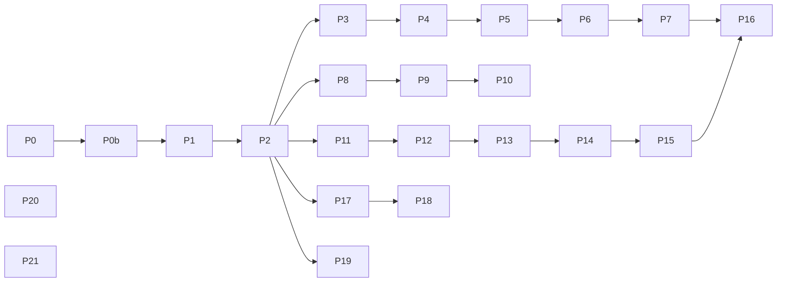

# Refactoring plan

Status: **implemented through Checkpoint 3.** Snapshot taken 2026-09-30 against
`main` after F14 (all milestones F1–F14 implemented, four-target gate green).
Re-verified 2026-09-30 against `main` at `9435f8c` (after `curated-sample-dirs`,
`web-keyboard-focus`, `physics-tunneling`, the physics-GC fix and
`audio-source-model`); line numbers below reflect that revision.

This plan is **behavior-preserving only**. No script-facing API change, no
`js-api` spec delta, no `efx.d.ts` change, no golden re-baseline. Anything that
would change observable behavior (including error *messages*) is out of scope
and is listed under [Deferred: behavior changes](#deferred-behavior-changes)
so it can go through its own OpenSpec change.

**Progress.** Phase A–B (P0, P0b, P1, P2) is implemented by the OpenSpec change
`refactor-safety-net` — **Checkpoint 1 reached**. The error catalog
(`tests/scripts/s_error_catalog.js` + `.expected.txt`) and the dead-export
guard (`tools/check_exports.mjs`) landed, and every dead symbol in §1.2 was
removed (`tools/check_exports.mjs` now reports zero). Phases C–F (P3–P14) are
implemented by the OpenSpec change `refactor-split-modules` — **Checkpoint 2
reached**: the duplicated helpers were consolidated in place (P3–P6 desktop,
P8–P9 web, P11–P13 render) and the four large files split by domain
(P7 `src/api/api*.c`, P10 `src/web/js/*.js` + `src/web/bridge_*.c`,
P14 `src/render/render_*.c`). Phases G–I (P15–P21) are implemented by the
OpenSpec change `refactor-long-functions` — **Checkpoint 3 reached**: the long
functions are decomposed (P15–P16), the web runners share `tools/lib/web-host.mjs`
(P17), the CMake vendor targets share `efx_add_vendor_library` with
`compile_commands.json` unchanged (P18), the input files are renamed (P19), and
the API-reference ADR is renumbered to 0048 (P20). P21 (slimming `AGENTS.md`
"Current state") was dropped: it requires owner sign-off, which was not
obtained. The
catalog also found that desktop/web error messages drift more widely than §4.1
assumed: `s_error_catalog.js`'s `DIVERGENT` map lists the 18 known
divergences, recorded (not fixed) per §4.1.

---

## 1. Findings

### 1.1 Oversized modules

Non-blank line counts (vendored code and generated headers excluded).

| File | Lines | Problem |
|------|------:|---------|
| [src/api/api.c](../src/api/api.c) | ~5 970 | Whole quickjs binding in one TU; feature sections are **split and interleaved** (F11 at L1351 *and* L4466, F12 at L543 *and* L5838, F14 at L237 *and* L2572), held together by forward declarations (L85, L90, L671). |
| [src/web/entry.js](../src/web/entry.js) | ~3 790 | Whole web binding in one `--post-js`; only three section markers (L927, L2843, L3415). |
| [src/render/render.c](../src/render/render.c) | ~2 820 | Textures, targets, meshes, materials, post chain, records, particles and frame-end in one TU sharing the global `R`. |
| [src/web/bridge.c](../src/web/bridge.c) | ~1 900 | 179 `EMSCRIPTEN_KEEPALIVE` exports for every domain in one file. |
| [src/platform/pipeline.c](../src/platform/pipeline.c) | ~1 440 | `efx_pipeline_play` alone is 299 lines (L1181–L1479). |

Long functions (≥ 120 lines, heuristic scan):

| Function | Location | Lines |
|----------|----------|------:|
| `efx_pipeline_play` | pipeline.c L1181 | 299 |
| `efx_text_font_create` | text.c L282 | 281 |
| `build_surface` | gltf.c L510 | 197 |
| `efx_js_drawQuad` | api.c L3566 | 188 |
| `efx_js_createFont` | api.c L2296 | 183 |
| `efx_js_drawBillboard` | api.c L4559 | 177 |
| `efx_gltf_load_meshdata` | gltf.c L942 | 168 |
| `read_particle_config` | api.c L1646 | 164 |
| `efx_pipeline_install` | pipeline.c L438 | 151 |
| `parse_sprite` | api.c L4749 | 147 |
| `efx_runtime_new` | runtime.c L171 | 143 |
| `efx_render_mesh_create` | render.c L1468 | 141 |
| `efx_js_createMeshData` | api.c L4177 | 140 |
| `efx_skin_evaluate` | skin.c L384 | 134 |
| `efx_js_createImageData` | api.c L3200 | 129 |

### 1.2 Dead code (verified by cross-reference scan)

> **Resolved by `refactor-safety-net` (P1 + P2).** Every symbol listed below
> was removed, with its header declaration; `tools/check_exports.mjs` now
> reports zero dead exports. The two gamepad seam symbols were kept and are
> now exercised by the `gp_seams` input test (design D6). The list is kept
> here as the historical record of what P1/P2 removed.

No `#if 0`, `TODO`, `FIXME` or references to removed APIs (`loadTexture`,
`drawModel`, global `setMaterial`) were found anywhere in `src/`.

**Unused web bridge exports** — exported from `bridge.c` but never called from
`entry.js`, tools, tests or the gallery (entry.js tracks liveness itself):

- `efx_bridge_texture_alive` (L214), `efx_bridge_fontdata_alive` (L386),
  `efx_bridge_font_alive` (L442), `efx_bridge_target_alive` (L533),
  `efx_bridge_particles_alive` (L658), `efx_bridge_mesh_alive` (L1018),
  `efx_bridge_physics_body_alive` (L1883),
  `efx_bridge_physics_character_alive` (L1968).

**Unused C exports** — defined + declared in a header, never referenced from
`src/` or `tests/`:

| Symbol | Definition |
|--------|-----------|
| `efx_log` | api.c L24 / api.h L88 |
| `efx_audio_sample_rate`, `efx_audio_available` | audio.c L173, L194 |
| `efx_audio_voice_looping` (added by `audio-source-model`) | audio.c L527 / audio.h L93 |
| `efx_decoder_channels` | decode.c L91 |
| `efx_input_gamepad_load_mappings` (plural) | efx_gamepad.c L358 |
| `efx_input_gamepad_inject_clear` | efx_gamepad.c L841 |
| `efx_physics_body_is_dynamic` / `_is_sensor` / `_is_mesh` | world.c L300–L310 |
| `efx_physics_shape_is_mesh` | world.c L950 |
| `efx_resource_root` | resource.c L143 |
| `efx_text_font_alive` | text.c L571 |

Also dangling: `efx_character_move` is declared in `world.h` L157 but has no
definition and no caller (pre-existing; caught on re-verification).

### 1.3 Duplicated paths

**Desktop binding (`api.c`)**

- *Two optional-field reader families with identical shape:* `phys_opt_number`
  / `_bool` / `_vec3` / `_mask` (L734–L790) and `pcfg_num` / `pcfg_vec` /
  `pcfg_range` (L1393–L1450). They differ only in error message and
  `double` vs `float`.
- *Four array readers:* `get_float_array` (fixed n, accepts `Uint8Array`,
  L151), `read_number_array` (variable n, malloc, L3785), `read_index_array`
  (L3835), `read_vec3` (malloc for three floats, L3924), `vec_from_value`
  (L1367). Their element loops are copies of each other, but their
  TypeError/RangeError rules are **different on purpose**.
- *`get_live_*` resolvers:* seven copies of "`JS_GetOpaque2` → 'expected a X' →
  'using a destroyed …'" (`get_live_body` L681, `get_live_character` L694,
  `get_live_ps` L1353, `get_live_imagedata` L3330, `get_live_render_target`
  L3343, `get_live_meshdata` L4318, `get_live_mesh` L671).
- *Read-only property getters:* about 12 near-identical getters
  (Texture/ImageData/RenderTarget width/height, surfaceCount, Font metrics).
- *Class plumbing:* 13 finalizers with the same shape and 13
  `JS_NewClassID`/`JS_NewClass`/`JS_SetClassProto` triples in `efx_api_init`.

**Web binding (`entry.js`)**

- *Known-field check:* the "enumerate own names → throw `unknown … option`"
  loop is written inline **25 times** (L595, L708, L732, L830, L970, L1059,
  L1206, L1499, L1554, …, L2670). F12 has its own helper `__physKeys` (L2849),
  which uses `Object.keys` where the others use `Object.getOwnPropertyNames`.
- *Resource classes:* 13 wrapper classes each hand-roll `__alive`, `destroy()`,
  and guarded getters.

**Render core (`render.c`)**

- *Slot lookup:* `slot_get` / `mesh_get` / `rt_get` / `ps_get` (L355–L415) all
  decode `gen<<32 | idx` and check `used && gen`, differing only in the
  pool and the render-target tag bits.
- *Pool growth:* the same "double capacity + realloc" block appears for
  textures (**twice inside `efx_render_texture_create`**, L474 and L519),
  targets (L740), meshes (L1485), particle systems (L2362), records (L1923),
  and four deferred-release queues (L555, L775, L1668, L2426).
- *Texture creation:* the queued (no-sink) path and the live path in
  `efx_render_texture_create` (L455–L545) each initialise every `tex_slot`
  field separately.
- *Material maps:* retain/release call the same helper once per map channel
  (ambient/diffuse/specular/emissive/alphaMask), written out by hand.

**Pipeline (`pipeline.c`)**

- In `efx_pipeline_play`, three copies of "apply pipeline → bind vbuf + view +
  sampler → draw" (the quad-run, billboard and particle branches), two copies
  of "grow a pair of parallel `int` arrays", and inline particle depth-sort code.

**Tools**

- `run_web_goldens.mjs`, `run_web_harness.mjs`, `run_gallery_smoke.mjs` (and
  the server half of `test_web_assets.mjs`) each duplicate the
  `puppeteer-core` dynamic import, the static `http.createServer`, and the
  browser launch/page wiring.

### 1.4 Legacy / structural patterns

- **Validation lives in three places** for most option bags: the desktop C
  binding, `entry.js`, and (for particles/post) the core itself
  (`ps_config_valid` render.c L2068, `post_entry_valid` L946). Parity depends
  on `tools/run_web_compare.mjs`.
- **The parity net checks error kinds, not messages.** The `s_*_validation.js`
  scripts only assert `instanceof TypeError/RangeError`. The compare diffs
  stdout, but those scripts don't print messages. So today a message drift in
  one binding goes unnoticed, and so would a drift made during refactoring.
- Forward declarations are used to reach helpers defined thousands of lines
  later (api.c L85, L90, L671). This is a symptom of the ordering by milestone.
- File naming is inconsistent: `src/input/efx_input.c` and `efx_gamepad.c`
  have an `efx_` prefix, but every other module does not.
- ADR number collision: `0042-audio-mixing-and-vendoring.md` and
  `0042-api-reference-generated-from-type-doc.md`. The next free number is now
  **0048** (0043–0047 landed after this snapshot: `web-pointer-focus-default`,
  `curated-sample-dirs`, `physics-substepping`,
  `physics-world-holds-live-bodies`, `audio-source-model`).
- The "Current state" section of `AGENTS.md` repeats the roadmap table and
  specs (CI run IDs, per-milestone API lists). This goes against its own rule
  that the file "points rather than restates".

### 1.5 Intentional duplication (keep)

- `src/physics/efx_phys_vec.h` vs `src/math/` (GLM) — the physics core is
  dependency-free by design (ADR 0040).
- Core-side re-validation in `render.c` of values the bindings already
  validated. This is defense in depth at the C ABI boundary and is kept.

---

## 2. Validation ladder

Every pass names the minimum rung it must reach before it merges. Rungs are
cumulative.

| Rung | Check | Where |
|------|-------|-------|
| **V1** | `cmake -B build-h -DEFX_HEADLESS=ON` + `ctest --test-dir build-h` (unit suites: api, render, text, input, audio, physics, math) | local |
| **V2** | Full Windows build with goldens: `cmake -B build -DEFX_BUILD_GOLDEN_TESTS=ON …` + `ctest --test-dir build -C Release` (smoke + unit + goldens on D3D11) | local |
| **V3** | Generated-file checks: `python tools/gen_prelude.py --check`, `npm --prefix gallery run docs:check` | local |
| **V4** | `python3 tools/verify_remote.py all <branch>` — native ctest incl. goldens on llvmpipe, Emscripten ctest, web goldens, `run_web_compare.mjs` | SSH server |
| **V5** | `gh workflow run ci.yml --ref <branch>` in the order Linux → Windows → macOS (Metal catches clip-depth/attachment regressions, ADR 0025) | CI |

Extra evidence per pass:

- **Move-only diffs** are reviewed with `git diff -M --color-moved=dimmed-zebra`.
  The only non-dimmed lines should be includes, `static` → internal-header
  declarations, and section headers.
- **Symbol stability:** before and after the pass, compare
  `nm -g --defined-only` (or `dumpbin /symbols`) of `efx_core` for passes
  that must not change the exported surface.
- **Error catalog** (added in P0): its expected-output file must stay
  byte-identical unless the pass explicitly targets it (none do).

---

## 3. Passes

Each pass is one reviewable commit or PR on its own branch. Passes inside a
phase are independent unless noted. Phases are ordered so that later
restructuring works on code that is already smaller.

### Phase A — Safety net

#### P0. Error-message characterization catalog

- **Current behavior:** the validation scripts assert only the error class,
  and `run_web_compare.mjs` compares stdout, which those scripts leave mostly
  empty. The messages themselves (`"unknown particle option 'x'"`,
  `"numeric option fields must be finite numbers"`, …) are not pinned.
- **Structural improvement:** add `tests/scripts/s_error_catalog.js`. It walks
  every option bag and resource-liveness path (2D, 3D, lighting, targets,
  post, resources, text, particles/billboards/sprites, input, physics,
  gamepad, audio) and prints `Kind: message` per case. Commit its expected
  output as `tests/scripts/s_error_catalog.expected.txt`. Add an
  `EXPECT_OUT_FILE` mode to `tests/run_test.cmake` / `add_player_test`, and a
  `error_catalog` case to `run_web_compare.mjs`. Add a probe for the
  suspected coercion divergence (see §4) but record, don't fix.
- **Validation:** V4. The new case passes on desktop and web. Known
  differences between the two are recorded as `// KNOWN-DIVERGENCE` lines in
  the script so the compare stays green, and are listed in §4.

#### P0b. Dead-export guard script

- **Current behavior:** nothing detects unused exports; this plan's §1.2 list
  was built by hand.
- **Structural improvement:** add `tools/check_exports.mjs`. It lists
  `EMSCRIPTEN_KEEPALIVE` functions in `bridge.c` not referenced as `_name`
  from `src/web/**` or `tools/**`, and public `efx_*` definitions referenced
  nowhere else. It is advisory and not part of the gate.
- **Validation:** running it reproduces the §1.2 list exactly.

### Phase B — Delete dead code

#### P1. Remove unused bridge liveness exports

- **Current behavior:** eight `efx_bridge_*_alive` functions are exported and
  kept alive in the wasm, but entry.js never calls them.
- **Structural improvement:** delete them from `bridge.c`. This shrinks the
  export table and the wasm size.
- **Validation:** V4 (Emscripten ctest, web goldens, compare,
  `run_web_harness.mjs`), plus P0b reports none.

#### P2. Remove unused C exports

- **Current behavior:** the §1.2 C functions are compiled and declared but
  never called.
- **Structural improvement:** delete each one with its header declaration.
  Split into one commit per module (api, audio, input, physics, resource,
  text). Before each deletion, grep `openspec/specs/` and `docs/decisions/` —
  if a spec names the symbol as a C-level contract, keep it and drop it from
  this list instead. Candidates for "keep as test seam" rather than delete:
  `efx_input_gamepad_inject_clear` and `efx_input_gamepad_load_mappings`. If
  kept, add a unit test so they stop being dead.
- **Validation:** V1 + V2. The `nm` diff shows only the removed symbols.

### Phase C — Consolidate helpers inside the desktop binding

All Phase C passes are in-place (no file moves yet), so reviewers see real
diffs rather than moves.

#### P3. One optional-field reader family — **done**

- **Current behavior:** `phys_opt_*` and `pcfg_*` implement the same
  "absent = 0 / set = 1 / error = −1, throws" contract with different
  messages and float widths.
- **Structural improvement:** add one family, for example
  `opt_number(ctx, obj, key, &double, msg)`, `opt_bool`, `opt_vec3`,
  `opt_u32`, placed with the other helpers near L69. Rewrite `phys_opt_*`
  and `pcfg_num` as thin wrappers that pass their *existing* message string,
  then inline the wrappers at call sites. Do not merge the messages.
- **Validation:** V1 + V2, and the P0 catalog is byte-identical.

#### P4. Share the numeric element loop across array readers — **done**

- **Current behavior:** `get_float_array`, `read_number_array`,
  `read_index_array`, `read_vec3` and `vec_from_value` each loop over
  elements with slightly different rules. For non-numbers,
  `get_float_array` coerces and throws a RangeError, while
  `read_number_array` throws a TypeError. `get_float_array` also accepts
  `Uint8Array` bytes.
- **Structural improvement:** extract one internal
  `read_elements(ctx, v, len, policy, sink)`. Here `policy` encodes the
  existing per-reader rules (coerce vs strict, integer range, error class),
  and each public reader becomes a few lines. `read_vec3` stops mallocing.
  The rule differences stay; they are now named in one place instead of
  being implicit.
- **Validation:** V1 + V2 + V4, and the P0 catalog is byte-identical.
  Reviewers check a table in the PR description that maps each old reader to
  its policy.

#### P5. Generic live-opaque resolver and getter — **done**

- **Current behavior:** seven `get_live_*` functions and about 12 read-only
  getters repeat the same unwrap/throw sequence.
- **Structural improvement:** add
  `live_opaque(ctx, v, class_id, "expected a X", "using a destroyed …", alive_fn)`.
  Build getters from a `JS_CGETSET_MAGIC_DEF` table that dispatches on
  `magic`. Keep message strings exactly as-is per class; some classes say
  "using a destroyed resource" and others name the class.
- **Validation:** V1 + V2 + V4, and the P0 catalog is byte-identical
  (destroyed-resource cases are in the catalog).

#### P6. Table-driven class registration and finalizers — **done**

- **Current behavior:** `efx_api_init` spells out 13 class registrations, and
  13 finalizers share one shape.
- **Structural improvement:** add a static `class_spec[]`
  `{ &id, name, finalizer, proto_funcs, n }` that is looped in
  `efx_api_init`. Finalizers stay per-class, because release functions
  differ, but share a `finalize_common` for the `alive`/`free` skeleton.
- **Validation:** V1 + V2. `api_tests` GC/finalizer cases and
  `s_resource_lifecycle.js` pass.

### Phase D — Split the desktop binding (move-only)

#### P7. Split `api.c` by domain — **done**

- **Current behavior:** one ~5 970-line TU. Sections for F11, F12 and F14 are
  each split in two, and forward declarations bridge the gaps.
- **Structural improvement:** add `src/api/api_internal.h`, holding the
  class IDs, wrapper structs, error helpers and the P3–P5 readers. Split
  into `api.c` (init, lifecycle hooks, `efx` object assembly), `api_2d.c`,
  `api_3d.c` (mesh data, mesh, camera, pose), `api_lighting.c`,
  `api_target_post.c`, `api_resource.c`, `api_text.c`, `api_particles.c`
  (both halves merged), `api_input.c` (keyboard/mouse/window/gamepad),
  `api_physics.c` (both halves merged), and `api_audio.c` (both halves
  merged). Remove the forward declarations. Do this as a sequence of
  commits, one domain per commit, each move-only.
- **Validation:** V1 + V2 + V5 (compile on MSVC/Clang/GCC). The
  `--color-moved` review shows only moves, and the `nm -g` diff is empty.

### Phase E — Web binding

#### P8. `entry.js`: one known-field helper — **done**

- **Current behavior:** 25 inline loops plus `__physKeys`. Message
  formats vary: `"unknown option 'x'"` vs `"unknown <where> option 'x'"`.
  Enumeration also varies: `getOwnPropertyNames` vs `Object.keys`, which
  treat non-enumerable properties differently.
- **Structural improvement:** add
  `__efxCheckKnown(obj, knownList, where, enumerate)`, where `where` may be
  empty, to produce each existing format. Pass `enumerate` explicitly where
  a site uses `Object.keys`. Replace all sites.
- **Validation:** V4, and the P0 catalog compare is identical on web.

#### P9. `entry.js`: resource-class factory — **done**

- **Current behavior:** 13 hand-written wrapper classes duplicate liveness,
  idempotent `destroy()`, and guarded getters.
- **Structural improvement:** add
  `__efxResourceClass(name, { destroy, getters, methods })`. It keeps
  `instanceof` identity, prototype method names, and class `name` (the
  gallery type doc and the catalog both observe these).
- **Validation:** V4 (`run_web_harness.mjs`, gallery smoke, catalog).

#### P10. Split `entry.js` and `bridge.c` by domain (move-only) — **done**

- **Current behavior:** single `--post-js=src/web/entry.js`, single
  `bridge.c`.
- **Structural improvement:** move to `src/web/js/*.js` fragments
  (`core`, `render2d`, `render3d`, `resource`, `text`, `particles`, `input`,
  `physics`, `audio`, `boot`). Either concatenate them in fixed order at
  build time into a generated `entry.js`, or pass them as ordered
  `--post-js` flags; the second option needs no generator. Update
  `LINK_DEPENDS`. Split `bridge.c` into `bridge_*.c` along the same domains,
  with a private `bridge_internal.h` for slot tables.
- **Validation:** V4 + V5 (Emscripten job). The concatenated output must be
  byte-identical to the pre-split `entry.js` apart from whitespace at
  fragment seams; check with `diff`.

### Phase F — Render core

#### P11. Generic pool helpers in `render.c` — **done**

- **Current behavior:** four handle decoders and nine "double + realloc"
  growth blocks. Each has slightly different failure handling: the
  live-texture path destroys the native object on OOM, while the queues are
  best-effort.
- **Structural improvement:** add `pool_grow(void **arr, int *cap, int need, size_t elem, int initial)`
  and `handle_decode(h, tag, &idx, &gen)`. The four `*_get` functions become
  two-line wrappers. Keep each call site's OOM branch unchanged.
- **Validation:** V1 (render_tests lifecycle/generation cases) + V2 goldens.

#### P12. Unify texture-slot initialisation — **done**

- **Current behavior:** `efx_render_texture_create` initialises a `tex_slot`
  twice (queued and live paths). The queued path **always appends and never
  reuses** freed slots; the live path scans for a free slot first.
- **Structural improvement:** add
  `tex_slot_init(s, w, h, wrap, filter, mipmaps, native, pending)`, called by
  both paths. **Preserve the append-vs-reuse difference.** Handle values are
  observable to the core tests, and changing reuse belongs in §4.
- **Validation:** V1 + V2. Add a unit test that pins current handle
  sequencing for queued creation before the change.

#### P13. Material-map loops — **done**

- **Current behavior:** retain and release each list five map fields by hand.
- **Structural improvement:** add a `static const size_t MAP_OFFSETS[]` (or
  an accessor returning the five handles) and loop over it.
- **Validation:** V1 (F4b retention tests) + V2 (map goldens).

#### P14. Split `render.c` (move-only) — **done**

- **Current behavior:** one TU owning global `R`.
- **Structural improvement:** add `src/render/render_internal.h` (the `R`
  state struct, pool helpers, slot types). Split into `render_texture.c`,
  `render_target.c`, `render_mesh.c` (mesh data, meshes, materials, rig),
  `render_post.c`, `render_records.c` (record push, runs, frame
  begin/end, deferred release), and `render_particles.c`. `render.h` stays
  the public API, unchanged.
- **Validation:** V1 + V2 + V5, with a move-only review and an empty `nm -g`
  diff.

### Phase G — Long functions

#### P15. Decompose `efx_pipeline_play` — **done**

- **Current behavior:** 299 lines covering scratch sizing, quad-run emission,
  billboard/particle emission with the alpha depth sort, the VBO upload,
  pass switching for render targets, per-record draws, and the post chain.
- **Structural improvement:** extract, in call order,
  `ensure_scratch(quad_count)`, `emit_quad_runs(...)`,
  `emit_billboards_and_particles(...)` (with
  `sort_particles_back_to_front(...)`), `upload_vertices(total)`, and
  `play_records(...)`. Also extract
  `draw_textured(pip, handle, first, count)` to replace the three bind/draw
  copies, and `grow_int_pair(...)` for the two parallel-array growths. Do not
  touch the depth-remap fold in `play_mesh_record` (ADR 0025).
- **Validation:** V2 + V4 (all goldens incl. particles/billboards/targets/
  post) + **V5 through macOS** (Metal/D3D11 flip and depth paths).

#### P16. Decompose the remaining long functions (one PR per module) — **done**

| Function | Extract into |
|----------|--------------|
| `efx_text_font_create` (text.c) | glyph-set resolution → pack → rasterize (+ outline/shadow) → atlas build |
| `build_surface`, `efx_gltf_load_meshdata` (gltf.c) | per-attribute accessor import, index import, material conversion, rig attach |
| `efx_js_drawQuad`, `efx_js_drawBillboard`, `parse_sprite` (api) | option parsing (`read_quad_opts`, …) separate from recording |
| `efx_js_createFont`, `read_particle_config`, `efx_js_createMeshData`, `efx_js_createImageData` (api) | one reader per sub-object (outline/shadow, sizes/colors/quads/shape, surfaces) |
| `efx_render_mesh_create` (render.c) | surface copy, material bind/retain, rig/skin state init |
| `efx_skin_evaluate` (skin.c) | clip sampling, blend, FK/palette, skinning |
| `efx_runtime_new` (runtime.c) | context setup, class/API install, prelude eval |

- **Current behavior:** unchanged per function.
- **Structural improvement:** each function becomes an orchestration of named
  steps under ~60 lines. Error-return order stays identical, so the first
  failing check still throws the same message.
- **Validation:** V1 + V2 + P0 catalog byte-identical. For text/glTF/skin,
  the corresponding goldens and `text_tests`/`resource_tests`/`render_tests`
  skin cases pass.

### Phase H — Tools and build

#### P17. Shared web test runner library — **done**

- **Current behavior:** three puppeteer runners and one asset test each
  hand-roll the dynamic import, static server and browser launch.
- **Structural improvement:** add `tools/lib/web-host.mjs` exporting
  `loadPuppeteer()`, `serveStatic(root, routes)`, and
  `launchBrowser(opts)`. The runners keep their CLI, env vars and exit codes.
- **Validation:** V4 (`run_web_goldens`, `run_web_harness`), plus
  `run_gallery_smoke.mjs` and `test_web_assets.mjs` run locally with
  unchanged output.

#### P18. CMake vendor-target helper (optional) — **done**

- **Current behavior:** the miniz/cgltf/dr_libs targets repeat
  include/warning-relaxation boilerplate.
- **Structural improvement:** add
  `efx_add_vendor_library(name SOURCES … INCLUDES …)`.
- **Validation:** V2 + V5 (all four toolchains configure and build). The
  flags in `compile_commands.json` are identical before and after.

### Phase I — Naming and documentation hygiene

#### P19. Consistent input file names — **done**

- **Current behavior:** `src/input/efx_input.{c,h}` and `efx_gamepad.{c,h}`
  are the only prefixed module files.
- **Structural improvement:** rename them to `input.{c,h}` and
  `gamepad.{c,h}` with `git mv`, and update includes and CMake. Symbol names
  are unchanged.
- **Validation:** V1 + V5.

#### P20. Resolve the ADR 0042 collision — **done**

- **Current behavior:** two ADRs are numbered 0042. `AGENTS.md` cites 0042
  for audio.
- **Structural improvement:** renumber
  `0042-api-reference-generated-from-type-doc.md` to **0048** (0043–0047 are
  now taken), and update
  `docs/decisions/README.md` and any citations (`grep -r "0042"`).
- **Validation:** every link in `docs/decisions/README.md` resolves, and a
  grep finds no stale "0042 — The API reference" citations.

#### P21. Slim `AGENTS.md` "Current state" (needs owner sign-off) — **dropped** (no sign-off)

- **Current behavior:** about 430 lines (lines 8–441) restating per-milestone
  API surfaces, CI run IDs, and the roadmap table.
- **Structural improvement:** replace it with a short status list per
  milestone that links to the roadmap spec, the archived change, and the
  ADR. Keep the operational rules (verification order, server pre-check,
  merge/push policy) verbatim.
- **Validation:** review by the repo owner. Every fact removed is reachable
  from `openspec/specs/feature-roadmap`, `docs/decisions/` or
  `openspec/changes/archive/`.

---

## 4. Deferred: behavior changes

These came up during the analysis but change observable behavior. Each needs
its own OpenSpec change (and a `js-api` delta where script-visible). They
must **not** be folded into the passes above.

1. **Numeric-coercion divergence — confirmed.** On desktop, `phys_opt_number`
   and `pcfg_num` call `JS_ToFloat64`, which coerces `'0.5'` → 0.5 (and
   `true` → 1); on web, `__physNumber` requires `typeof v === 'number'`. The
   P0 catalog's `coercion.phys-number-string` case records it (desktop accepts,
   web throws `TypeError`). Fixing it means picking one rule in a spec delta.
   The catalog also found **17 further message-text divergences** across 2D/3D,
   lighting, resources, particles, billboards, physics and audio; they are
   listed in the `DIVERGENT` map in `tests/scripts/s_error_catalog.js`. All are
   recorded (canonical `KNOWN-DIVERGENCE` lines), not fixed.
2. **Single source of truth for validation.** Today's three-way validation
   (C binding, entry.js, core) could collapse by moving option-bag validation
   into the shared C core behind a binding-neutral "option reader" interface,
   or into the shared prelude. This is an architectural decision and would
   need an ADR.
3. **Queued textures never reuse freed slots** (`efx_render_texture_create`
   no-sink path). Harmless at current scales but asymmetric with the live
   path.
4. **O(n) free-slot scans** in the render pools. A free list would change
   handle-allocation order.

---

## 5. Suggested order and checkpoints

- **Checkpoint 1** (after P2): dead code is gone. Run the full V5 gate once.
- **Checkpoint 2** (after P7, P10 and P14): every large file is split. Run V5.
- **Checkpoint 3** (after P16): the long functions are decomposed. Run V5,
  then merge to `main` per `AGENTS.md`.

P20 and P21 are documentation-only and can land at any time.
